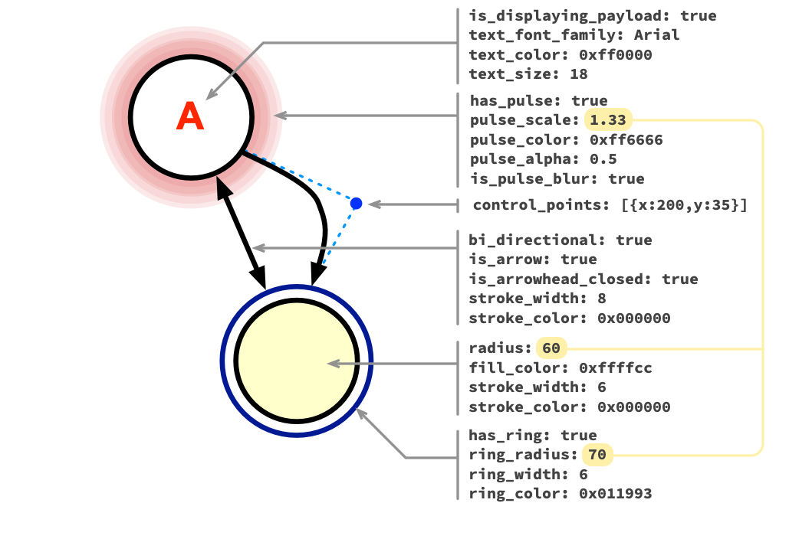

_beta: GraphFellow is still in development!_

* [quick start](index)
* [examples](examples)
* [HTML for graphs](html)
* settings & config
* [programming graph behaviour](behaviour)


# Config and settings

This page describes how to configure your graphs.

You also need a container (in your HTML) to put it in: see docs on [the HTML
for the container](html), which also describe how to pass these settings to
GraphFellow.

## Graph components

GraphFellow graphs are made of the following components. Each type can have an
associated payload, which can optionally be displayed.

Vertices and edges are not expected to change — that is, adding or removing
vertices or edges is not explicitly supported. Travellers, however, can be
created and destroyed.

| **vertices**   | Vertices are the nodes of the directed graph. Vertices must have a unique ID. All vertices are rendered as circles. Vertices can be rendered with an additional ring, and can be made to pulse (showing an animated surround).
| **edges**      | Edges are rendered as lines joining the vertices of the graph, and are directed (that is, they have a `from` and a `to` vertex). Edges can be bi-directional, and can be drawn with or without arrowheads. An edge can loop, joining a vertex to itself.
| **travellers** | Travellers move along the edges, vertex-to-vertex, and can be either circles ("spots") or graphics (sprites). Travellers can have `on_departure` and `on_arrival` event handlers, which can be useful for programming [graph behaviour](behaviour).


## Configuration

The configuration for a graph can be presented either as a JavaScript object
with the properties described below, or a JSON file which is loaded by AJAX. If
both are available, the JavaScript object wins and the `.json` file will _not_
be loaded.

The JSON structure is as follows: three arrays (defining each of the
components) and a `config` object that declares settings for the whole graph as
well as global settings for each of the component types.


```javascript
vertices: [],     // array of specific vertice definitions
edges: [],        // array of specific edge definitions
travellers: [],   // array of specific traveller definitions
config: { 
  // global config items (for the graph)
  // ...and settings for types:
  vertices: {},   // config settings for _all_ vertices
  edges: {},      // config settings for _all_ edges
  travellers: {}, // config settings for _all_ travellers
  resources: []   // array of resource values for external resouces (i.e., sprite bitmaps)
}
```

Remember that JSON requires keys and string values to be quoted with double
quotes, but in JavaScript you can define objected without quoting the keys.

The settings should be defined with underscore separators (`background_color`),
but GraphFellow tries to be forgiving if you've used hyphens by mistake in your
JSON (`background-color`) because frankly life is too short to waste time
spotting _that_ particular bug.

Here's an example showing how some config settings apply to vertices and edges.
Note how the `vertices` settings for `pulse_scale`, `radius` and `ring_radius`
are related.



### Config for the whole graph

These settings apply to the graph and its behaviour. The text settings will be
inherited by all the components of the graph unless you override them.

Everything is optional, because undeclared settings fall back to the default
values.

| `config`               | default    | meaning
|------------------------+------------|----------------------
| `grid_width`           | `1000`     | the nominal width of the grid used by any coordinates (`x`, `y`) and sizes in the graph. You usually don't need to change this, because the graph will _always_ automatically scale to fit the width of its container. For this reason, this is **not** a width in pixels.
| `grid_height`          | `grid_width` | if you don't specify a height, `aspect_ratio` will be used to calculate it. But if you want to be explicit, set a height here: if it's the same as `grid_width`, you'll get a square graph. This setting overrides `aspect_ratio`.
| `aspect_ratio`         | `1`        | as an alternative to specifying `grid_height`, you can specify a y/x aspect ratio here: `0.5` is a graph that is half as high as it is wide. If you want your graph height to inherit its container's height (defined by CSS), set this to `0`.
| `is_container_height`  | `false`    | if `true`, the graph will be rendered with the height of the container, effectively ignoring the `aspect_ratio` or `grid_height` settings: see more about [dimensions of the graph](html#dimensions-of-the-graph)
| `on_init`              | `null`     | named function to run, once, when graph is being initialised
| `tick_period`          | `0`        | how frequently, in seconds, the "clock" ticks (see `on_tick`). `0` means `never`. Use a decimal for small periods (e.g., `0.05`), but don't expect anything faster than 1/60th of a second to work.
| `on_tick`              | `null`     | named function to run on each tick
| `antialias`            | `true`     | determines if all the edges should be rendered smoothly on the graph. You probably want `true` because it looks prettier, but this comes at the cost of more processing overhead in the browser.
| `background_color`     | `0xffffff` | background colour of graph
| `text_color`           | `0x000000` | default text (fill) colour
| `text_font_size`       | `20`       | default text size (see `grid_width`)
| `text_font_family`     | `Arial`    | default text font family
| `text_font_style`      | `normal`   | default text font style (e.g., `italic`)
| `text_font_weight`     | `normal`   | default text font weight (e.g., `bold`)
| `is_text_wordwrap`     | `false`    | default text wordwrap enabled
| `text_wordwrap_width`  | `1000`     | default text wordwrap width (see `grid_width`)

The graph's coordinate system is nominally 1000 × 1000, unless you've changed
the `grid_width` value (which you probably never need to do). The graph will be
scaled to fit whatever size (in pixels) your container is.

Note that it's possible to [override these settings](html#overriding-config-in-the-html)
in the `data-graph-config` attribute of the container in the HTML.

### Defining the vertices

Each vertex requires an `id`, which is a string that must be unique within the
graph, and a coordinate position (`x`, `y`) on the canvas.

| setting         | default      | meaning
|-----------------+--------------+----------------------
| `id`            | *no default* | give every vertex a unique `id` (it can be any string) — you need this in order to define the edges that connect to it
| `x`             | `0`          | x coordinate of the centre of the vertex
| `y`             | `0`          | y coordinate of the centre of the vertex (default grid is 1000 pixels)

If you specify a graph with `id`s that are not unique for every vertex, things
will go wonky. Don't do that.

> In addition, any of the global settings from `config.vertices` (see below)
> apply, overriding that setting (or its default) for the individual vertex.

### Defining the edges

Each edge requires a `from` and a `to` vertex and, optionally, an array of
`control_points`.

| setting           | default       | meaning
|-------------------+---------------|----------------------
| `from`            | *no default*  | id of the vertex from which the edge starts
| `to`              | *no default*  | id of the vertex at which the edge ends
| `control_points`  | `[]`          | array of `{x,y}` points specifying the curve of the edge: none (straight line, the default), one (quadratic bezier), or two (cubic bezier)

You can specify the same value for `from` and `to` in order to describe an edge
which loops on a single vertex. If you do this you *must* provide two control
points to make the curve visible (see below).

> In addition, any of the global settings from `config.edges` (see below) apply,
> overriding that setting (or its default) for the individual edge.

#### Edge control points

For straight edges, no control points are needed. As this is the default, you
don't need to specify any `control_points` setting in your graph.

The control points are relative to the `from` vertex (that is, they are **not**
coordinates on the global canvas).

An edge that starts and ends at the same vertex (a loop) *will not be visible*
unless you explicitly force it to curve outside the vertex using two control
points. For example:

```javascript
{
  "vertices": [
    {
      "id": "A", 
      "x": 500, 
      "y": 200, 
      "radius": 80, 
     "stroke_width": 8
    }
  ],
  "edges": [
    {
      "from": "A",
      "to": "A",
      "control_points": [ {"x": -420, "y": 300}, {"x": 520, "y": 400}]
      "stroke_width": 8
    }
  ]
}
```


### Defining the travellers

Each traveller requires an `at_vertex`, which must be an id of a vertex.

| setting           | default    | meaning
|-------------------+------------|----------------------
| `at_vertex`       | no default | id of the vertex the traveller is located at

> In addition, any of the global settings from `config.travellers` (see below)
> apply, overriding that setting (or its default) for the individual traveller.

You can specify an `id` for the traveller, but this is optional. If you do need
`id`s (because you're defining behaviour that needs them) then the policy of
enforcing their uniqueness is down to you.

It's possible that a graph will have no travellers defined in its initial
settings, if you've added [behaviour](behaviour) (named functions) that create
them.

The `journey_lifespan` of a traveller — either defined explicitly here, or in
the global config for all travellers — determines how many journeys the
traveller will make before being destroyed. The most useful values are these:

| `journey_lifespan` | meaning
|--------------------+--------------
| `0`                |  _unlimited journeys_: use this if you want to move a persistent traveller around the graph
| `1`                | _single journey_: use this if you want to program travellers that only exist on a journey-by-journey basis
| _n_                | _specific n_: traveller makes _n_ journeys


The `on_departure` and `on_arrival` events are unique to travellers, and you
can programmatically create and destroy travellers: see [behaviour](behaviour)
for more information.


### Config for all vertices

The configuration for vertices in general can be declared within the `vertex{}`
section of the config.

These are _not_ describing the vertices themselves (do that in the `vertices`
array).

Vertices are circles. Any of these settings can be overridden on an individual
vertex's declaration. Everything is optional, because undeclared settings fall
back to the default values.

| `config.vertices{}`    | default          | meaning
|------------------------+------------------|----------------------
| `stroke_width`         | `2`              | thickness of the line around the vertex
| `stroke_color`         | `0x000000`       | colour of the line
| `fill_color`           | `0xffffff`       | colour of the area inside the vertex
| `radius`               | `20`             | radius of the vertex
| `has_ring`             | `false`          | `true` if the vertex has an outer ring: see `ring_radius`
| `ring_radius`          | `25`             | if `has_ring` is true, this is the radius of that ring. <br>**Note**: if `ring_radius` is smaller than the `radius`, *you will not be able to see it*
| `ring_width`           | `2`              | thickness of the ring, if `has_ring` is true
| `ring_color`           | `0x000000`       | color of the ring line (stroke), if `has_ring` is true
| `on_click`             | `null`           | what function should be run if the vertex is clicked. Set this to null if you don't want any interaction.
| `on_moueseover`        | `null`           | what function should be run if the mouse pointer moves over the vertex. Set this to null if you don't want any interaction.
| `has_pulse`            | `true`           | `true` if the vertex can pulse. All `pulse` settings are ignored if this is `false`.
| `pulse_color`          | `0xff0000`       | colour of the pulse
| `pulse_alpha`          | `0.5`            | alpha of the pulse (`0` is transparent, `1` is fully opaque) <br>**Note**: if `pulse_alpha` and `pulse_exit_alpha` are both `0` *you will not be able to see it*
| `pulse_exit_alpha`     | `0`              | alpha of the pulse when it finishes pulsing, so `0` fades out completely
| `pulse_duration`       | `1`              | duration in seconds of the pulse
| `pulse_scale`          | `1.75`           | how much bigger than the radius of the vertex the pulse can be <br>**Note**: if `pulse_scale` is `1` or smaller, *you will not be able to see it*
| `is_pulse_yoyo`        | `true`           | `true` if the pulse expands and contracts (in which case the `pulse_duration` adjusts to fit)
| `is_pulse_blur`        | `true`           | `true` if the pulse should be blurred
| `is_displaying_payload`| `true`           | `true` if the value of the vertex's payload should be displayed
| `payload`              | `0`              | initial value of the payload
| `has_id_as_payload`    | `true`           | if no initial payload value is supplied, and `has_id_as_payload` is `true`, use the vertex's id instead
| `payload_offset_x`     | `0`              | the payload value is displayed in the middle of the vertex: nudge it horizontally by this amount
| `payload_offset_y`     | `0`              | the payload value is displayed in the middle of the vertex: nudge it vertically by this amount
| `text_color`           | global default   | override global text color for all vertices
| `text_font_size`       | global default   | override global text size for all vertices
| `text_font_family`     | global default   | override global text font family for all vertices
| `text_font_style`      | global default   | override global text style for all vertices
| `text_font_weight`     | global default   | override global text weight for all vertices
| `is_text_wordwrap`     | global default   | override global text wordwrap for all vertices
| `text_wordwrap_width`  | global default   | override global text wordwrap width for all vertices

### Config for all edges

The configuration for edges in general can be declared within the `edges{}`
section of the config.

These are _not_ describing the edges themselves (do that in the `edges` array).

Edges are lines, optionally with arrowhead(s) at the end (or both ends, if the
edge is bi-directional). Any of these settings can be overridden on an
individual edges's declaration. Everything is optional, because undeclared
settings fall back to the default values.

| `config.edges{}`       | default    | meaning
|------------------------+------------|----------------------
| `is_bidirectional`     | `false`    | `true` if travellers can travel from the 'to' end back to the 'from' end
| `journey_duration`     | `1`        | duration, in seconds, of the complete journey from start to end
| `stroke_color`         | `0x000000` | colour of the line marking the edge
| `stroke_width`         | `2`        | width of the line marking the edge
| `is_arrow`             | `true`     | `true` if the line should have an arrowhead at the 'to' end (or, if `is_bidirectional` is true, both ends)
| `arrowhead_angle`      | `33`       | the angle, in degrees, of the arrowhead
| `arrowhead_length`     | `15`       | the length, from the tip to the back, of the arrowhead
| `is_arrowhead_closed`  | `true`     | the arrowhead is made by two lines either side of the edge's line, joining at the tip. If `true`, the arrowhead is closed and becomes a filled triangle
| `is_displaying_payload`| `false`    | `true` if the value of the edges's payload should be displayed
| `payload`              | `null`     | initial value of the payload
| `payload_offset_x`     | `0`        | the payload value is displayed in the middle of the edge: nudge it horizontally by this amount
| `payload_offset_y`     | `0`        | the payload value is displayed in the middle of the edge: nudge it vertically by this amount
| `on_click`             | `null`     | what function should be run if the edge is clicked. Set this to null if you don't want any interaction.
| `on_moueseover`        | `null`     | what function should be run if the mouse pointer moves over the edge. Set this to null if you don't want any interaction.
| `text_color`           | global default   | override global text color for all edges
| `text_font_size`       | global default   | override global text size for all edges
| `text_font_family`     | global default   | override global text font family for all edges
| `text_font_style`      | global default   | override global text style for all edges
| `text_font_weight`     | global default   | override global text weight for all edges
| `is_text_wordwrap`     | global default   | override global text wordwrap for all edges
| `text_wordwrap_width`  | global default   | override global text wordwrap width for all edges

### Config for all travellers

A traveller is a thing that traverses the graph by moving from vertex to vertex
via an edge.

These are _not_ defining the travellers themselves (do that in the
`travellers` array).

A traveller can be a circle (a "spot") or a bitmap graphic (a "sprite"). Any
of these settings can be overridden on an individual traveller's declaration.
Everything is optional, because undeclared settings fall back to the default
values.

| `config.travellers{}`  | default       | meaning
|------------------------+---------------|----------------------
| `type`                 | `spot`        | either `spot` or `sprite`           
| `is_above_vertices`    | `false`       | `true` if the traveller is rendered above the vertices. If `false`, travellers disappear underneath the vertices when they arrive.
| `journey_lifespan`     | `0`           | how many journeys the traveller can make before it is destroyed. `0` is the special case of immortality: the traveller will never die. `1` indicates the traveller will make a single journey and then die.        
| `radius`               | `10`          | the radius of the spot-type traveller
| `stroke_width`         | `2`           | the thickness of the border of the spot-type traveller
| `stroke_color`         | `0x000000`    | the colour of the border of the spot-type traveller
| `fill_color`           | `0x000000`    | the colour of the spot-type traveller (or the tint of the sprite)
| `is_tinted`            | `false`       | `true` if the `fill_color` should be used to tint the sprite (sprite-type travellers only)
| `speed`                | `1`           | how quickly this traveller executes its journeys (each edge has a `journey_duration` in seconds). `0.5` moves at half speed, `2` goes twice as fast.
| `resource_id`          | `pixi-bunny`  | the name of the resource to use as the bitmap for a sprite-type traveller
| `sprite_scale`         | `1`           | the scale of the sprite-type traveller
| `is_displaying_payload`| `false`       | `true` if the value of the traveller's payload should be displayed
| `on_departure`           | `null`        | what function should be run when the traveller departs on its journey
| `on_arrival`           | `null`        | what function should be run when the traveller arrives at the end of its journey
| `on_click`             | `null`        | what function should be run if the edge is clicked. Set this to null if you don't want any interaction.
| `on_moueseover`        | `null`        | what function should be run if the mouse pointer moves over the traveller. Set this to null if you don't want any interaction.
| `payload`              | `0`           | initial value of the payload       
| `payload_offset_x`     | `0`           | the payload value is displayed in the middle of the traveller: nudge it horizontally by this amount
| `payload_offset_y`     | `0`           | the payload value is displayed in the middle of the traveller: nudge it vertically by this amount
| `text_color`           | global default | override global text color for all travellers
| `text_font_size`       | global default | override global text size for all travellers
| `text_font_family`     | global default | override global text font family for all travellers
| `text_font_style`      | global default | override global text style for all travellers
| `text_font_weight`     | global default | override global text weight for all travellers
| `is_text_wordwrap`     | global default | override global text wordwrap for all travellers
| `text_wordwrap_width`  | global default | override global text wordwrap width for all travellers


